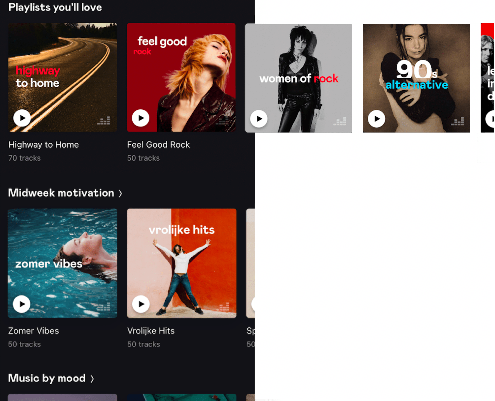
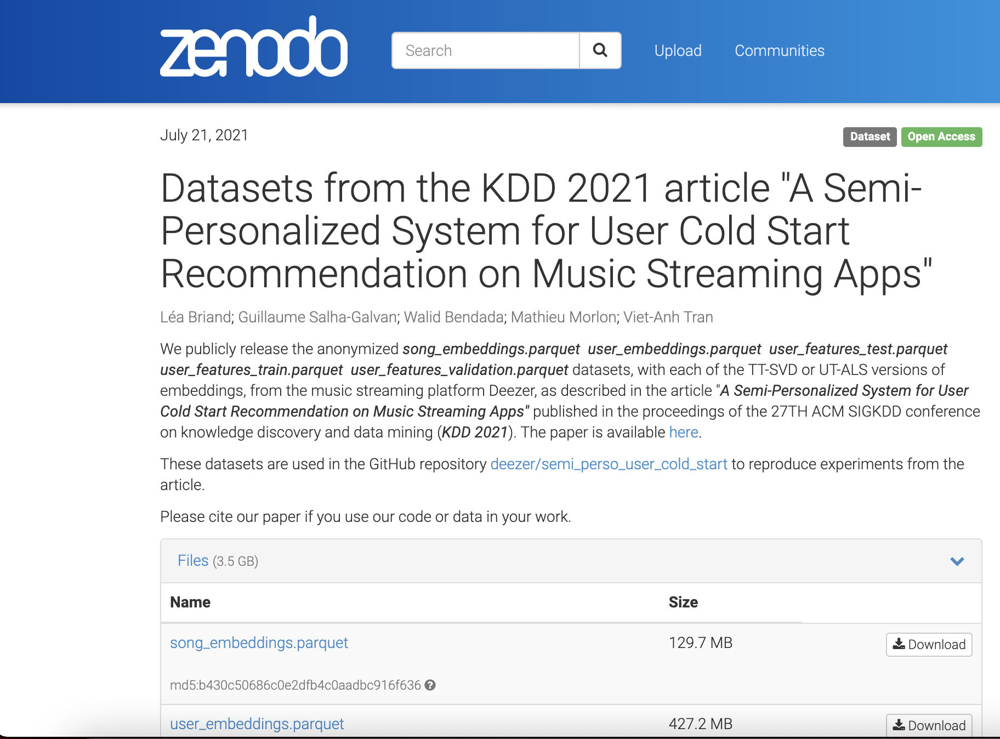
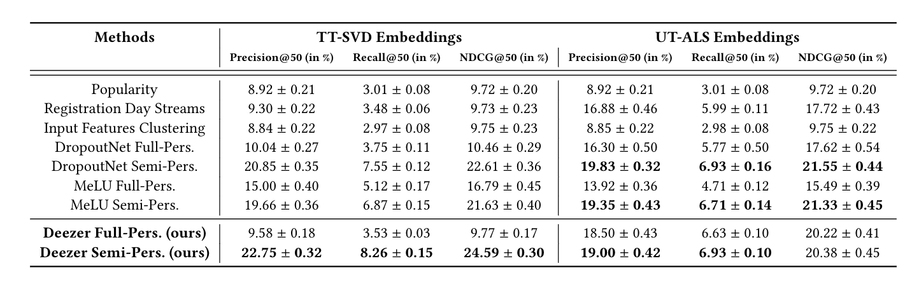

# A Semi-Personalized System for User Cold Start Recommendation on Music Streaming Apps

This repository provides Python code to reproduce experiments from the article [A Semi-Personalized System for User Cold Start Recommendation on Music Streaming Apps](https://arxiv.org/pdf/2106.03819.pdf) published in the proceedings of the 27th ACM SIGKDD Conference on Knowledge Discovery and Data Mining ([KDD 2021](https://virtual.2021.kdd.org/index.html)).

## Recommending Musical Content on Deezer 

Music streaming services heavily rely on recommender systems to improve their users’ experience, by helping them navigate through a large musical catalog and discover new songs, playlists, albums or artists.

To recommend personalized musical content to users, [Deezer](https://www.deezer.com/) leverages **latent models for collaborative filtering**. In a nutshell, these models aim at learning vector space representations of users and items, a.k.a. **embedding representations**, where proximity should reflect user preferences. More specifically, two different methods, referred to as **UT-ALS** and **TT-SVD** embeddings, are consider in this work. We refer to [our paper](https://arxiv.org/pdf/2106.03819.pdf) for technical details.

<p align="center">
  
</p>

#### The User Cold Start Problem

However, performances of such models tend to significantly degrade for new users who only had few interactions with the catalog. They might even become unsuitable for users with no interaction at all, who are absent from user-item matrices in standard algorithms. This is commonly referred to as the **user cold start problem**. Yet, recommending relevant content to these new users is crucial for online services such as Deezer. Indeed, a new user facing low-quality recommendations might have a bad first impression and decide to stop using the service.

More precisely, our work aim at addressing the following problem: **given an existing latent model for collaborative filtering learning an embedding space from a set of "warm" users, how can we effectively include new "cold" users into this same space, by the end of their registration day on Deezer?** 

Our [KDD paper](https://arxiv.org/pdf/2106.03819.pdf) presents the industrial-scale semi-personalized system recently deployed on Deezer to address this problem.

#### Offline Evaluation

This repository provides code and data to reproduce our **offline experiments**. In the paper, an online A/B test on Deezer complements these experiments.

**Setting:** Through experiments on an offline dataset of 100 000 active users described thereafter, we evaluate to which extent the proposed recommendations at registration day would have matched the actual musical preferences of a set of users on their first month on the service. Specifically, we compute the 50 most relevant music tracks for each user of the dataset, from our proposed model and registration day’s input features (described in [the paper](https://arxiv.org/pdf/2106.03819.pdf)). We compare them to the tracks listened by each user during their next 30 days on Deezer, using three standard recommendation metrics: the **Precision@K**, the **Recall@K**, as well as the Normalized Discounted Cumulative Gain (**NDCG@K**) as a measure of ranking quality.

## Installation

#### Code

```Bash
git clone https://github.com/deezer/semi_perso_user_cold_start
cd semi_perso_user_cold_start
```

_Requirements: python 3, torch, matplotlib, numpy, pandas, fastparquet, matplotlib, sklearn, pickle, statistics, random_

#### Data

We release eight datasets :
- `song_embeddings.parquet`:  a dataset of 50 000 fully anonymized Deezer songs. Each song is described by:
    - a song index (field `song_index`)
    - 128-dimensional TT-SVD embedding vector (fields `features_svd`)
    - 256-dimensional UT-ALS embedding vector (fields `features_mf`)
- `user_embeddings.parquet`: a dataset of 70 000 fully anonymized Deezer users representing our training dataset. Each user _u_ is described by:
    - a user index (field `user_index`)
    - a 128-dimensional embedding vector (field `svd_embeddings`) summarizing the user's musical preferences in the TT-SVD space
    - a 256-dimensional embedding vector (field `mf_embeddings`) summarizing the user's musical preferences in the UT-ALS space
For each of the embedding space - TT-SVD space or UT-ALS one - we release : 
- `user_features_train_svd.parquet` (or `user_features_train_mf.parquet`) with 70 000 fully anonymized Deezer users of the training dataset
- `user_features_validation_svd.parquet` (or `user_features_validation_mf.parquet`) with 20 000 fully anonymized Deezer users of the validation dataset
- `user_features_test_svd.parquet` (or `user_features_test_mf.parquet`) with 10 000 fully anonymized Deezer users of the test dataset 
These three last datasets contain the features used to predict the user embedding, from which we deduce the top K songs most liekly to be listened in the 30 days after their regstration day. For each of the dataset, we have the following features fields :
    - a user index (field `user_index`)
    - a list of the listened songs during the 30 days following their registration day - the groundtruth songs (field `d1d30_songs`)
    - a 128 or 256 - dimensional embedding vector for each feature (fields for example for age : `age_embedding0` to `age_embedding128` or `age_embedding256`). Features can be age, country, favorite_songs, favorite_artists, favorite_albums, favorite_playlists, onboarding_like_artists, skipped_songs, skipped_artists, skipped_albums, streamed_songs, streamed_artists, streamed_albums, banned_songs, banned_artists, banned_albums, search_songs, search_artists, search_albums, search_playlists
    - a number of interactions done with each action (field for example for the number of favorite songs entered : `nb_favorite_songs`)
    - age of the user (field `age_value`)


#### Download complete datasets

Due to size restrictions, the datasets are [available for download on Zenodo](https://zenodo.org/record/5121674#.YQuiitMzaIZ).

Please download it there and subsequently place it in the `data` folder. 

<p align="center">
  
</p>

## Run Offline Experiment

Simulations proceed as detailed in [Section 4.1](https://arxiv.org/pdf/2106.03819.pdf).

One can choose to run the experiment considering the TT-SVD embedding space or UT-ALS one by changing the parameters in the `options.py` file - by default set up to run on the TT-SVD embedding space. Please set the `use_cuda` option to `False` in the absence of GPU.

Type in the following command to run offline experiments with similar hyperparameters w.r.t. the paper:

```Bash
python main.py
```

Estimated running times with TT-SVD embeddings on a standard machine: 
- data generation : 5084 seconds
- training model (with GPU) : 9 seconds
- eval full perso : 1418 seconds
- clustering : 14672 seconds
- eval semi perso : 991 seconds

One should obtain results (up to slight variations due to randomness) similar to Table 1 from the paper: 

<p align="center">
  
</p>

#### Next Steps

The current repository runs our proposed **Deezer Full-Personalized** and **Deezer Semi-Personalized** methods.

Other baselines will be added in the upcoming days.


## Cite

Please cite our paper if you use this code or data in your own work:

```BibTeX
@inproceedings{briand2021semipersousercoldstart,
  title={A Semi-Personalized System for User Cold Start Recommendation on Music Streaming Apps},
  author={Briand, Lea and Salha-Galvan, Guillaume and Bendada, Walid and Morlon, Mathieu and Tran, Viet-Anh},
  booktitle={27th ACM SIGKDD Conference on Knowledge Discovery and Data Mining (KDD 2021)},
  year={2021}
}
```
